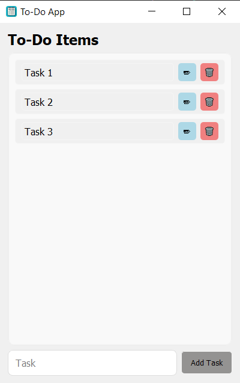

# ✅ PyQt5 To-Do List App

A minimal desktop To-Do list app built with PyQt5 and Python. Supports:
- Adding tasks
- Editing tasks
- Deleting tasks
- Saving tasks locally

## 📸 Screenshot


## 💻 How to Run

1. Clone the repository:
```bash
git clone https://github.com/your-username/todo-app.git
cd todo-app
